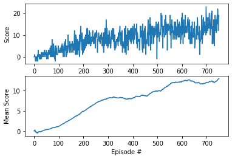

# Deep Q-Network (DQN) Report

## Learning Algorithm

The Deep Q-Network (DQN) algorithm was implemented to solve the environment. DQN is a reinforcement-learning algorithm that approximates the optimal action-value function using a neural network. One main feature is the use of **two Q-Networks**: a local Q-network (for selecting actions and learning) and a target Q-network (for computing target Q-values). The algorithm consists of the following main steps which are conducted in each episode.

1. Get the current state and determine the **epsilon-greedy policy** action.
2. Execute the action and obtain the reward and the next state.
3. Store the experiences (state, action, reward, next_state, done) in a **replay buffer**.
4. If there are enough experience tuples (batch size), sample a minibatch from the replay buffer and do a learning step.
5. Learning involves computing the Q targets for current states and the expected Q values from the local model, then minimizing the squared error between these with respect to the model parameters. This updates the local network parameters.
5. The target network parameters are updated towards the local network parameters using a soft update with parameter $\tau$.

## Model Architecture

Each Q-network is a fully connected feedforward neural network with the following architecture:
- **Input Layer:** Size equal to the state space (37 for the Banana environment).
- **Hidden Layer 1:** 64 units, ReLU activation.
- **Hidden Layer 2:** 64 units, ReLU activation.
- **Output Layer:** Size equal to the action space (4 for the Banana environment), representing Q-values for each action.

## Hyperparameters

The following hyperparameters were used for training:

| Hyperparameter | Value         | Description                                  |
|---------------|---------------|----------------------------------------------|
| BUFFER_SIZE   | 10000         | Replay buffer size                           |
| BATCH_SIZE    | 64            | Minibatch size for learning                  |
| GAMMA         | 0.99          | Discount factor for future rewards           |
| TAU           | 1e-3          | Soft update parameter for target network     |
| LR            | 1e-4          | Learning rate for optimizer                  |
| EPS_START     | 1.0           | Initial epsilon for exploration              |
| EPS_END       | 0.01          | Minimum epsilon                              |
| EPS_DECAY     | 0.995         | Multiplicative factor for epsilon decay      |

## Results

The following plot shows the rewards and mean rewards for each episode. The data is given in ``training_scores.json``.

## Ideas for Future Work

Ideas for improving this work include tuning some hyperparameters, but also implementing extensions to DQN, e.g. prioritized experience replay, where the more important transitions are sampled with a higher probability, or double DQN, where we could select the action for the next state using a different set of parameters (here: the local network) and evaluate it using the target network. 
